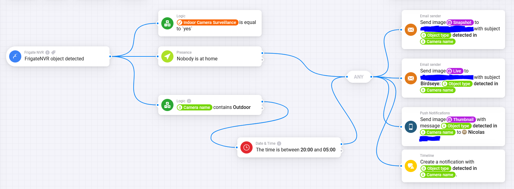
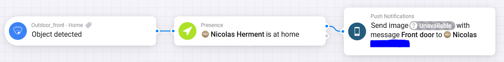
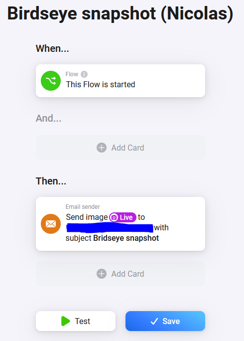
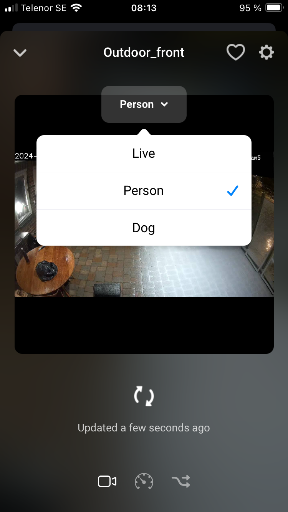
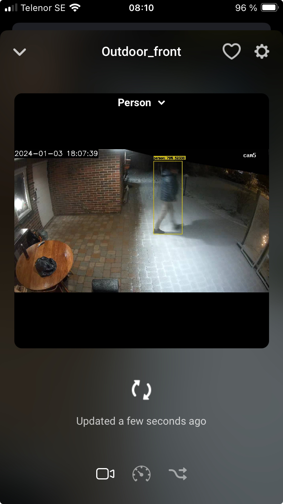

# Homey Frigate

Frigate NVR integration for Homey

This integration brings your existing Frigate NVR object detection into Homey.

## Pre-requisites

- A network accessible Frigate NVR instance (from your Homey Pro device)
- Access from Homey to the MQTT server that Frigate uses. This is optional but Homey triggers will not work without Homey connecting to MQTT.git 

## Global trigger card

The global trigger card will trigger for any event generated by any camera.

This card provides a few tokens:

| Token       | Type   | Description                                                                                                       |
|-------------|--------|-------------------------------------------------------------------------------------------------------------------|
| Camera name | string | The FrigateNVR name of the camera that detected an object                                                         |
| Object type | string | The type of object detected. This is the value provided by Frigate so it's lower case. e.g. 'person', 'dog', etc. |
| Clip URL    | string | The URL of the mp4 clip on Frigate's API. Note that this can be empty                                             |
| eventId     | string | The id of the Frigate event                                                                                       |
| snapshot    | image  | A snapshot image of the detection event. Snapshots must be enabled in Frigate's configuration           |
| thumbnail   | image  | A thumbnail of the event. This is typically friendlier to mobile devices than a snapshot                          |

Below is an example of how the global trigger can be used:

## Device trigger card

The device trigger card is essentially the same as the global one. The difference is that it only triggers for a specific camera.

## Accessing camera images in Flows

It is possible to access images from your cameras from any flow even without using a camera trigger.
Example this simple flow sends a live snapshot of the Birdseye view to my email on demand:

## Camera

### Views

Each camera provide a `Live` image which is the latest image from Frigate's live feed. In addition, cameras will provide snapshots of the latest objects they detected.

In addition to the live view, all cameras but the birdview will provide snapshots of their latest detected objects:

Image options:

Snapshot of the last person detected:

### Tokens

Cameras provide some permanent tokens:
- `Occupancy`: The number of persons currently detected. I found occupancy to be quite unreliable but you can try to use it.
- `Person detected`
- `Dog detected`
- `Cat detected`
- `Car detected`
- `Bicycle detected`
- `Motorcycle detected`

## MQTT

By default Homey will use the same credentials as Frigate has them defined from the configuration. This can be changed later per camera.

## Roadmap

Below is a list of what will be implemented next:

1. Ability to export the RTSP feed from the birsdeye view to a video provider (e.g. Vimeo)
3. Ability to export the event video clip to a video provider (e.g. Vimeo)
4. Dynamically add camera tokens based on the objects detected by Frigate. e.g. `Dog occupancy`/`Dog detected`, `Car occupancy`/`Car detected`, etc.

